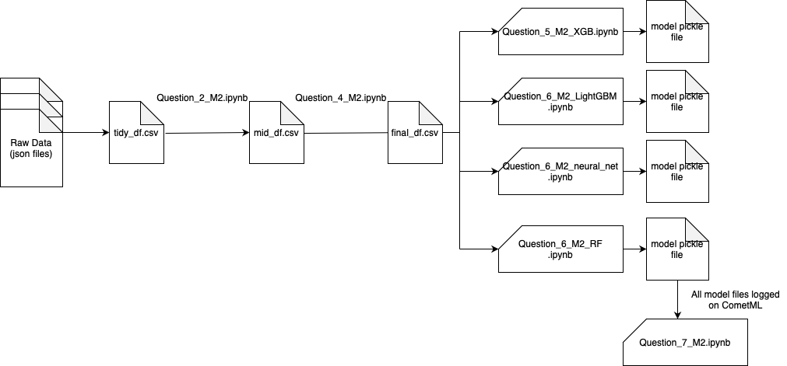

# IFT6758 Project 2021

The Project is based upon the national sport of Canada: Ice hockey! We use both the aggregate and the play-by-play data captured by NHL API.

## Milestone 3

This third milestone allows us to integrate our models to work with live data and make predictions for games results. 

## Milestone 2

#### Data Flow Diagram for the pipeline

## Milestone 1

### 1. Introduction

The first milestone focuses on the first two stages of the project i.e. 
* Extracting and cleaning the raw data fetched using the NHL API. 
* Analyzing this data over the seasons, using visualizations and interactive tools.

### 1.a. Project Setup

* **ift6758-project-template-main/ift6758/data/**: Contains the modules for the questions 1, 2 and 4 i.e. to retreive, download and tidy the raw data from the NHL API.
* **ift6758-project-template-main/ift6758/visualizations/**: Contains the module for question 6 that deals with the advanced visualizations using plotly.
* **ift6758-project-template-main/notebooks/**: Contains the notebooks for individual questions from 1 to 6, which in turn make use of the modules written above.

**Note:** This section assumes that one is running the codebase from the repository folder.
Instructions required for any due installations can be found [here](https://github.com/etiennedemers/ift6758/tree/master/ift6758-project-template-main#readme).

### 1.b. Blogpost Setup

* **ift6758-blog-template-main/_posts/**: Contains the project's static webpage markdown file
* **ift6758-blog-template-main/figures/**: Contains all the plots generated and included in the blog post
* **ift6758-blog-template-main/_includes/**: Contains the plotly visualization generated as an HTML file 

This blog post is currently served locally, So, the instructions for the same are included [here](https://github.com/etiennedemers/ift6758/tree/master/ift6758-blog-template-main#readme).

### References

All the links to the articles or posts referred in order to answer a questions have been added in-line with the content and the python notebooks.
